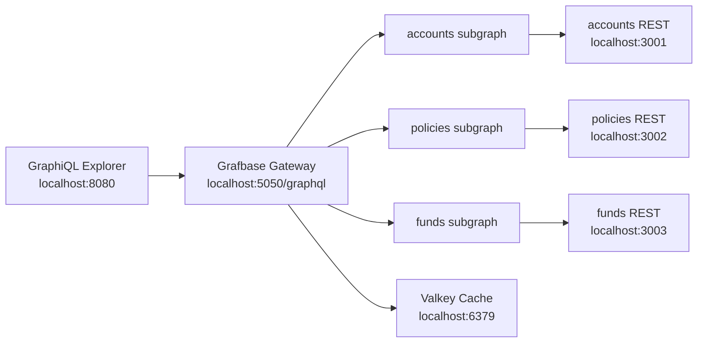

# Grafbase REST Federation POC

This POC federates three mock REST APIs for an insurance, pensions, and investments domain:

- `accounts-rest`: pension and investment accounts
- `policies-rest`: life, annuity, and investment policies
- `funds-rest`: pension/investment fund catalogue and performance

The REST services expose OpenAPI documents, small Apollo Federation subgraphs wrap those REST endpoints, and `ghcr.io/grafbase/gateway` runs the federated graph. A GraphiQL UI is served at `http://localhost:8080` via a plain nginx container (no React, no build step).

## Architecture



## Run With Docker

Build and start everything:

```bash
docker compose up --build
```

Open GraphiQL:

```text
http://localhost:8080
```

Grafbase GraphQL endpoint:

```text
http://localhost:5050/graphql
```

REST endpoints:

```text
http://localhost:3001/openapi.json
http://localhost:3002/openapi.json
http://localhost:3003/openapi.json
```

Stop the stack:

```bash
docker compose down
```

Rebuild from scratch:

```bash
docker compose down
docker compose build --no-cache
docker compose up
```

## Environment Variables

Copy `.env.example` to `.env` to override defaults:

```bash
# REST API keys (defaults shown)
ACCOUNTS_API_KEY=accounts-local-key
POLICIES_API_KEY=policies-local-key
FUNDS_API_KEY=funds-local-key

# Subgraph Valkey cache URL (default points to the Docker Compose valkey service)
CACHE_URL=redis://valkey:6379
# Per-subgraph TTLs are set directly in docker-compose.yml (120s / 30s / 300s)
```

Each REST service expects its own `X-Api-Key` header. Docker Compose passes matching keys to both the REST containers and their corresponding subgraphs automatically.

## Caching (Valkey)

Caching is implemented at **two layers**:

| Layer | Where | Backend | Notes |
|---|---|---|---|
| **Subgraph layer** | Each Apollo subgraph (Node.js) | **Valkey (persistent)** | REST API responses cached in Valkey via `ioredis`; survives gateway restarts |
| **Gateway layer** | Grafbase OSS gateway | In-memory only | Entity cache; cleared when gateway container restarts |

### Subgraph-level persistent caching

Each subgraph checks Valkey before calling its REST API. On a cache hit the REST API is not called at all. TTLs are configured per subgraph in `docker-compose.yml`:

| Subgraph | `CACHE_TTL` | Reason |
|---|---|---|
| accounts | 120s | Account data changes infrequently |
| policies | 30s | Policy status can change |
| funds | 300s | Fund prices update daily |

Cache keys follow the pattern `subgraph:<service>:<route>` (e.g. `subgraph:accounts:/accounts/acct-1001`).

**Graceful degradation:** if Valkey is unreachable, subgraphs fall back to direct REST calls automatically — no errors surfaced to the user.

### Testing the cache

```bash
# Watch live cache operations
docker exec -it grafbasepoc-valkey-1 valkey-cli MONITOR

# Check stored keys
docker exec grafbasepoc-valkey-1 valkey-cli KEYS "*"

# Wipe the cache
docker exec grafbasepoc-valkey-1 valkey-cli FLUSHALL

# Verify in-memory cache is working (request 1 is slowest, rest are fast)
for i in 1 2 3 4 5; do
  curl -s -o /dev/null -w "Request $i: %{time_total}s\n" \
    -X POST http://localhost:5050/graphql \
    -H "Content-Type: application/json" \
    -d '{"query":"{ account(id:\"acct-1001\") { holderName totalValue } }"}';
done
```

## GraphiQL Explorer

The `explorer/` directory is a plain nginx container — no React, no Vite, no npm install. `explorer/index.html` loads GraphiQL JS and CSS directly from `unpkg.com` CDN at runtime. To point it at a different GraphQL endpoint, change the `GRAPHQL_URL` constant in `explorer/index.html`.

## Sample Query

Run this in GraphiQL at `http://localhost:8080`:

```graphql
query InsurancePortfolio {
  account(id: "acct-1001") {
    id
    holderName
    accountType
    totalValue
    policies {
      policyNumber
      productName
      status
      linkedFunds {
        name
        assetClass
        oneYearReturnPercent
      }
    }
    fundHoldings {
      allocationPercent
      currentValue
      fund {
        name
        riskRating
        sustainabilityLabel
      }
    }
  }
}
```

## Regenerate The Federated Schema

If you change any subgraph schema in `subgraph-server/schemas/`, regenerate the supergraph before restarting Docker — otherwise the gateway uses the stale schema:

```bash
npm --prefix subgraph-server install
npm --prefix subgraph-server run compose
```

That rewrites `grafbase/supergraph.graphql`, which Docker mounts into the Grafbase Gateway.

## OpenAPI

Static OpenAPI specs live in `docs/`, and the running mock APIs expose compact OpenAPI JSON at:

- `GET /openapi.json` on accounts (:3001)
- `GET /openapi.json` on policies (:3002)
- `GET /openapi.json` on funds (:3003)

The GraphQL schema is generated from the federation SDL files using JS composition. The OpenAPI files document the REST surface that the subgraphs call.
