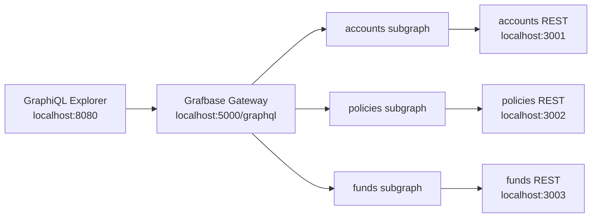

# Grafbase REST Federation POC

This POC federates three mock REST APIs for an insurance, pensions, and investments domain:

- `accounts-rest`: pension and investment accounts
- `policies-rest`: life, annuity, and investment policies
- `funds-rest`: pension/investment fund catalogue and performance

The REST services expose OpenAPI documents, small Apollo Federation subgraphs wrap those REST endpoints, and `ghcr.io/grafbase/gateway` runs the federated graph. A GraphiQL GUI is served at `http://localhost:8080`.

## Architecture



## Config-Level Key/Value

The Docker Compose file wires the REST API keys as config values:

- `ACCOUNTS_API_KEY`
- `POLICIES_API_KEY`
- `FUNDS_API_KEY`

Each REST service expects its own `X-Api-Key`, and each GraphQL subgraph receives the matching key through environment variables. Copy `.env.example` to `.env` if you want to override the defaults.

Grafbase-specific config is in `grafbase/grafbase.toml`. It configures gateway timeouts, CORS for the GraphiQL GUI, and subgraph URLs.

## Run With Docker

Build and start everything:

```bash
docker compose up --build
```

Open GraphiQL:

```text
http://localhost:8080
```

Grafbase GraphQL endpoint:

```text
http://localhost:5050/graphql
```

REST endpoints:

```text
http://localhost:3001/openapi.json
http://localhost:3002/openapi.json
http://localhost:3003/openapi.json
```

Stop the stack:

```bash
docker compose down
```

Rebuild from scratch:

```bash
docker compose down
docker compose build --no-cache
docker compose up
```

## Sample Query

Run this in GraphiQL:

```graphql
query InsurancePortfolio {
  account(id: "acct-1001") {
    id
    holderName
    accountType
    totalValue
    policies {
      policyNumber
      productName
      status
      linkedFunds {
        name
        assetClass
        oneYearReturnPercent
      }
    }
    fundHoldings {
      allocationPercent
      currentValue
      fund {
        name
        riskRating
        sustainabilityLabel
      }
    }
  }
}
```

## Regenerate The Federated Schema

If you change any subgraph schema in `subgraph-server/schemas`, regenerate the Grafbase supergraph:

```bash
npm --prefix subgraph-server install
npm --prefix subgraph-server run compose
```

That updates `grafbase/supergraph.graphql`, which Docker mounts into Grafbase Gateway.

## OpenAPI

Static OpenAPI specs live in `docs/`, and the running mock APIs expose compact OpenAPI JSON at:

- `GET /openapi.json` on accounts
- `GET /openapi.json` on policies
- `GET /openapi.json` on funds

For this POC, the GraphQL schema is generated from the federation SDL files using JS composition. The OpenAPI files document the REST surface that the subgraphs call.
