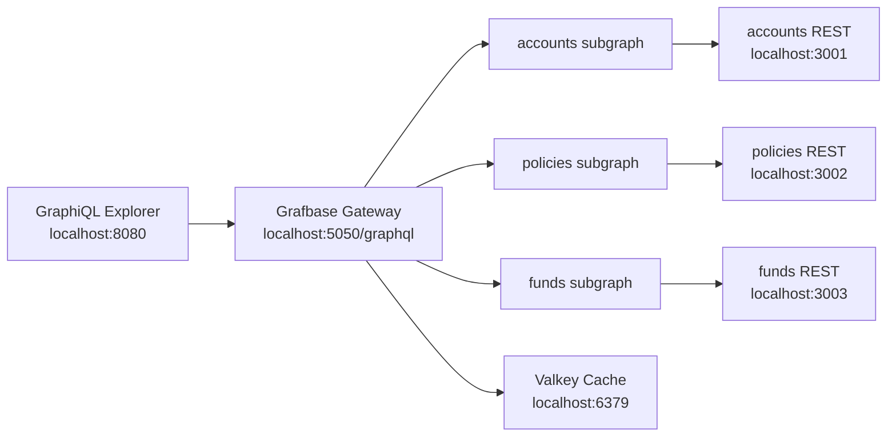

# Grafbase Insurance POC — Project Documentation

## Overview

A federation POC that exposes three mock REST APIs (accounts, policies, funds) through Apollo Federation subgraphs, unified by the Grafbase Gateway into a single GraphQL endpoint. A GraphiQL UI is served via Docker.

---

## Architecture

```
GraphiQL (:8080) → Grafbase Gateway (:5050/graphql)
                        ├── accounts-subgraph (:4000) → accounts-rest (:3001)
                        ├── policies-subgraph (:4000) → policies-rest (:3002)
                        └── funds-subgraph    (:4000) → funds-rest    (:3003)
```



---

## Key Files

| File | Role |
|------|------|
| `mock-rest-api/server.js` | Single Node.js file that spawns three HTTP servers (one per service) on ports 3001/3002/3003 |
| `subgraph-server/server.js` | Single Node.js file that runs as any of the three Apollo Federation subgraphs, selected by `SERVICE_NAME` env var |
| `subgraph-server/schemas/*.graphql` | Apollo Federation SDL for each subgraph (accounts, policies, funds) |
| `subgraph-server/scripts/compose-supergraph.js` | Composes the three SDL files into a supergraph using `@apollo/composition` |
| `grafbase/supergraph.graphql` | **Generated file** — the composed supergraph fed to Grafbase Gateway; do not hand-edit |
| `grafbase/grafbase.toml` | Gateway config: subgraph URLs, CORS, timeouts |
| `docker-compose.yml` | Wires all services; passes API keys via environment variables |
| `explorer/Dockerfile` | Pure nginx container — inlines both nginx config and GraphiQL HTML via `RUN` heredocs; no external files, no npm install |
| `bruno/` | Bruno API collection for REST and GraphQL endpoints |

---

## Commands

### Run the full stack

```bash
docker compose up --build
```

| Service | URL |
|---------|-----|
| GraphiQL UI | http://localhost:8080 |
| Grafbase GraphQL endpoint | http://localhost:5050/graphql |
| Accounts REST API | http://localhost:3001 |
| Policies REST API | http://localhost:3002 |
| Funds REST API | http://localhost:3003 |

### Stop / clean rebuild

```bash
docker compose down
docker compose build --no-cache && docker compose up
```

### Regenerate supergraph after schema changes

Must run before `docker compose up` when any SDL file in `subgraph-server/schemas/` is changed:

```bash
npm --prefix subgraph-server install
npm --prefix subgraph-server run compose
```

This rewrites `grafbase/supergraph.graphql`.

### Run mock REST API locally

```bash
cd mock-rest-api && node server.js
# accounts → :3001, policies → :3002, funds → :3003
```

---

## Environment Variables

Copy `.env.example` to `.env` to override defaults:

```bash
# REST API keys (defaults shown)
ACCOUNTS_API_KEY=accounts-local-key
POLICIES_API_KEY=policies-local-key
FUNDS_API_KEY=funds-local-key

# Required only for Enterprise gateway image (Valkey cache)
GRAFBASE_LICENSE_KEY=your-license-key-here
```

Each REST service requires an `X-Api-Key` header. Docker Compose passes matching keys to both REST containers and their subgraphs automatically.

---

## Federation Model

- `Account`, `Fund`, and `Policy` are federation entities (`@key(fields: "id")`).
- The **accounts** subgraph owns `Account` fields; policies and funds subgraphs extend it with `policies` and `availableFunds` fields respectively.
- The **policies** subgraph extends `Fund` with `linkedPolicies`.
- Cross-subgraph references use `__resolveReference` in `subgraph-server/server.js`.

---

## GraphQL Schema Summary

### Accounts subgraph (`schemas/accounts.graphql`)

```graphql
type Account @key(fields: "id") {
  id: ID!
  customerId: ID!
  holderName: String!
  accountType: String!
  status: String!
  openedDate: String!
  pensionProvider: String
  riskProfile: String!
  totalValue: Float!
  contributionRate: Float!
  fundHoldings: [FundHolding!]!
}

type Query {
  account(id: ID!): Account
  accounts(customerId: ID): [Account!]!
}
```

### Policies subgraph (`schemas/policies.graphql`)

```graphql
type Policy @key(fields: "id") {
  id: ID!
  policyNumber: String!
  policyType: String!
  productName: String!
  status: String!
  startDate: String!
  premiumMonthly: Float!
  sumAssured: Float!
  insuredPerson: String!
  linkedFunds: [Fund!]!
}

# Extends Account with:
#   policies: [Policy!]!
# Extends Fund with:
#   linkedPolicies: [Policy!]!

type Query {
  policy(id: ID!): Policy
  policies(accountId: ID): [Policy!]!
}
```

### Funds subgraph (`schemas/funds.graphql`)

```graphql
type Fund @key(fields: "id") {
  id: ID!
  isin: String!
  name: String!
  assetClass: String!
  currency: String!
  riskRating: Int!
  ongoingChargePercent: Float!
  oneYearReturnPercent: Float!
  threeYearReturnPercent: Float!
  sustainabilityLabel: String!
}

# Extends Account with:
#   availableFunds: [Fund!]!

type Query {
  fund(id: ID!): Fund
  funds: [Fund!]!
}
```

---

## REST API Endpoints

### Accounts (`:3001`)

| Method | Path | Description |
|--------|------|-------------|
| GET | `/accounts` | List all accounts |
| GET | `/accounts/{id}` | Get account by ID |
| GET | `/customers/{customerId}/accounts` | List accounts for a customer |
| GET | `/health` | Health check |
| GET | `/openapi.json` | OpenAPI spec |

**Headers:** `X-Api-Key: accounts-local-key`

**Example IDs:** `acct-1001`, `acct-1002`, `acct-2001`  
**Example Customer IDs:** `cust-501`, `cust-902`

### Policies (`:3002`)

| Method | Path | Description |
|--------|------|-------------|
| GET | `/policies` | List all policies |
| GET | `/policies/{id}` | Get policy by ID |
| GET | `/accounts/{accountId}/policies` | List policies for an account |
| GET | `/funds/{fundId}/policies` | List policies linked to a fund |
| GET | `/health` | Health check |
| GET | `/openapi.json` | OpenAPI spec |

**Headers:** `X-Api-Key: policies-local-key`

**Example IDs:** `pol-life-3001`, `pol-annuity-3002`, `pol-invest-3003`, `pol-life-9001`

### Funds (`:3003`)

| Method | Path | Description |
|--------|------|-------------|
| GET | `/funds` | List all funds |
| GET | `/funds/{id}` | Get fund by ID |
| GET | `/accounts/{accountId}/funds` | List funds held by an account |
| GET | `/health` | Health check |
| GET | `/openapi.json` | OpenAPI spec |

**Headers:** `X-Api-Key: funds-local-key`

**Example IDs:** `fund-global-equity`, `fund-green-bond`, `fund-cash-plus`, `fund-tech-growth`

---

## Sample GraphQL Queries

### Full Insurance Portfolio

```graphql
query InsurancePortfolio {
  account(id: "acct-1001") {
    id
    holderName
    accountType
    totalValue
    policies {
      policyNumber
      productName
      status
      linkedFunds {
        name
        assetClass
        oneYearReturnPercent
      }
    }
    fundHoldings {
      allocationPercent
      currentValue
      fund {
        name
        riskRating
        sustainabilityLabel
      }
    }
  }
}
```

### List All Funds

```graphql
query ListFunds {
  funds {
    id
    name
    assetClass
    riskRating
    oneYearReturnPercent
    threeYearReturnPercent
    sustainabilityLabel
  }
}
```

### Fund with Linked Policies

```graphql
query FundWithPolicies {
  fund(id: "fund-global-equity") {
    id
    name
    linkedPolicies {
      policyNumber
      productName
      status
    }
  }
}
```

---

## Caching (Valkey)

A Valkey container (Redis-compatible) runs alongside the gateway. Entity caching is configured in `grafbase/grafbase.toml`:

| Subgraph | TTL | Reason |
|----------|-----|--------|
| accounts | 120s | Account data changes infrequently |
| policies | 30s | Policy status can change |
| funds | 300s | Fund prices update daily |

> **Note:** The OSS gateway (`ghcr.io/grafbase/gateway:latest`) uses **in-memory** caching. The Valkey (Redis) backend requires the Enterprise image. Switch to `ghcr.io/grafbase/gateway:latest-enterprise` and set `GRAFBASE_LICENSE_KEY` in `.env` to activate Valkey.

### Cache testing commands

```bash
# Watch live cache operations
docker exec -it grafbasepoc-valkey-1 valkey-cli MONITOR

# Check stored keys
docker exec grafbasepoc-valkey-1 valkey-cli KEYS "*"

# Wipe the cache
docker exec grafbasepoc-valkey-1 valkey-cli FLUSHALL
```

---

## GraphiQL Explorer

The `explorer/` directory is a **pure nginx container** — no Node.js, no React, no build step, no external files.

### How it works

The `explorer/Dockerfile` inlines everything directly using `RUN` commands:

1. **nginx config** — written via `printf` into `/etc/nginx/nginx.conf` (listens on port 8080)
2. **GraphiQL HTML** — written via a heredoc into `/usr/share/nginx/html/index.html`

The HTML page loads React, GraphiQL JS, and GraphiQL CSS directly from `unpkg.com` CDN at runtime. No `npm install`, no build step, no external files needed.

### What changed (dockerisation update)

Previously the explorer folder contained three files:
- `index.html` — the GraphiQL page
- `nginx.conf` — custom nginx config
- `Dockerfile` — copied both files into the image

**After the change**, the folder contains only:
- `Dockerfile` — **all content is inlined**

```dockerfile
FROM nginx:alpine

RUN rm -rf /usr/share/nginx/html/*

# Inline nginx config
RUN printf '...' > /etc/nginx/nginx.conf

# Inline GraphiQL HTML
RUN cat > /usr/share/nginx/html/index.html <<'EOF'
<!doctype html>
...
EOF

EXPOSE 8080
CMD ["nginx", "-g", "daemon off;"]
```

**Benefits:**
- Zero external files to manage
- Truly self-contained Docker image
- To change the GraphQL endpoint URL, edit the `GRAPHQL_URL` constant inside the Dockerfile heredoc

---

## Bruno API Collection

A Bruno collection lives in `bruno/Grafbase Insurance POC/`. Open it in [Bruno](https://www.usebruno.com/) to run and test all REST and GraphQL endpoints.

### Collection structure

```
bruno/
└── Grafbase Insurance POC/
    ├── bruno.json
    ├── environments/
    │   └── local.bru          ← pre-configured for localhost
    ├── REST APIs/
    │   ├── Accounts/
    │   │   ├── List Accounts.bru
    │   │   ├── Get Account by ID.bru
    │   │   ├── List Accounts by Customer.bru
    │   │   ├── Health Check.bru
    │   │   └── OpenAPI Spec.bru
    │   ├── Policies/
    │   │   ├── List Policies.bru
    │   │   ├── Get Policy by ID.bru
    │   │   ├── List Policies by Account.bru
    │   │   ├── List Policies by Fund.bru
    │   │   ├── Health Check.bru
    │   │   └── OpenAPI Spec.bru
    │   └── Funds/
    │       ├── List Funds.bru
    │       ├── Get Fund by ID.bru
    │       ├── List Funds by Account.bru
    │       ├── Health Check.bru
    │       └── OpenAPI Spec.bru
    └── GraphQL/
        ├── Insurance Portfolio Query.bru
        ├── List All Accounts.bru
        ├── List All Funds.bru
        ├── List Policies by Account.bru
        └── Fund with Linked Policies.bru
```

### Using the collection

1. Install [Bruno](https://www.usebruno.com/) (free, open-source API client)
2. Open Bruno → **Open Collection** → select `bruno/Grafbase Insurance POC/`
3. Select the **local** environment (top-right dropdown)
4. Start the stack: `docker compose up --build`
5. Run any request

All API keys and base URLs are pre-configured in the `local` environment. No manual setup required.

---

## OpenAPI Specs

Static OpenAPI YAML files live in `docs/`:

| File | Service |
|------|---------|
| `docs/accounts.openapi.yaml` | Accounts REST API |
| `docs/policies.openapi.yaml` | Policies REST API |
| `docs/funds.openapi.yaml` | Funds REST API |

Live compact OpenAPI JSON is also served at runtime:

- `GET http://localhost:3001/openapi.json`
- `GET http://localhost:3002/openapi.json`
- `GET http://localhost:3003/openapi.json`
